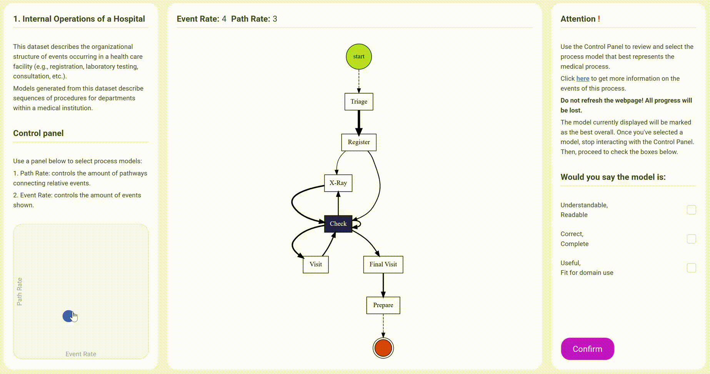

# Process Models Complexity Research Web App

This web application is designed to gather and analyze human perceptions of process models. It allows participants to provide demographic information and rate various process models, facilitating in-depth studies on model interpretability and identifying ideal metrics for evaluating model complexity and understandability.

**Project Link:** [Process Models Complexity Research](https://complexity-survey.ru/)

## Key Features

- **Frontend Development:**
  - Built using **HTML**, **Tailwind CSS**, and **JavaScript**.
  - Designed UI/UX using **Figma** for a seamless user experience.

- **Backend Development:**
  - Utilized **Python** with **Flask** for server-side logic.
  - Implemented **HTMX** for dynamic, real-time web interactions.
  - Used **SQLAlchemy** to interact with the database.

- **Data Tracking and Analytics:**
  - Developed a **mouse tracking script** to capture the movement of a 2D slider handle for more precise user input analysis.
  - Integrated **Yandex.Metrica** to track detailed user interactions for research insights.

- **Database Management:**
  - Set up a **PostgreSQL** database to store user inputs and designed the necessary tables for efficient data storage.

- **Containerization & Deployment:**
  - Containerized the application with **Docker Compose** for easy deployment and scalability.
  - Configured an **Nginx** server to host the project on **Yandex.Cloud**.
  - Implemented a **restart policy** to automatically restart Docker Compose on the virtual machine's boot.
